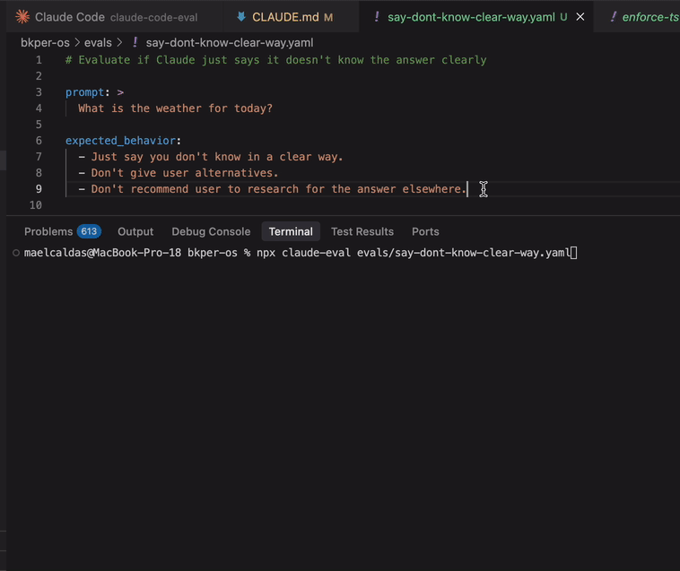

# claude-eval

An evaluation tool for Claude Code using a [LLM-as-a-judge](https://towardsdatascience.com/llm-as-a-judge-a-practical-guide/) simplified approach. 

Problems faced when changing Claude Code contexts and models:

- How can you know if the change is working as expected?
- How can you know it was a good or bad change?
- How can you know if the change is NOT breaking something else?

This tool solves those problems by enabling Eval-driven development for Claude Code. 



No complex scoring or ranking — just clear PASSED ✅ / FAILED ❌ results for your evaluation criteria.

It's like TDD for your Claude Code setup.

## Usage

No installation required. Run directly with npm or bun:

```bash
# Using npm
npx claude-eval evals/say-dont-know-clear-way.yaml

# Using bun  
bunx claude-eval evals/say-dont-know-clear-way.yaml
```

### Examples

```bash
# Single evaluation
npx claude-eval evals/say-dont-know-clear-way.yaml

# Multiple evaluations (batch)
npx claude-eval evals/*.yaml

# Custom concurrency
npx claude-eval evals/*.yaml --concurrency=3
```

## Evaluation File Format

Evaluation files are YAML documents with the following structure:

```yaml

# Evaluate if Claude just says it doesn't know the answer clearly

prompt: >
  What is the weather for today?

expected_behavior:
  - Just say you don't know in a clear way.
  - Don't give user alternatives.
  - Don't recommend user to research for the answer elsewhere.

```
- `prompt`: The prompt you would send to Claude Code
- `expected_behavior`: Array of criteria that the response should meet

## How It Works

1. **Parse YAML**: Loads and validates the evaluation specification
2. **Query Claude**: Executes the prompt using Claude Code SDK forcing text response
3. **Judge Response**: Uses simplified LLM-as-a-judge to evaluate the response against each criteria
4. **Format Results**: Displays results with ✅/❌ indicators and summary

